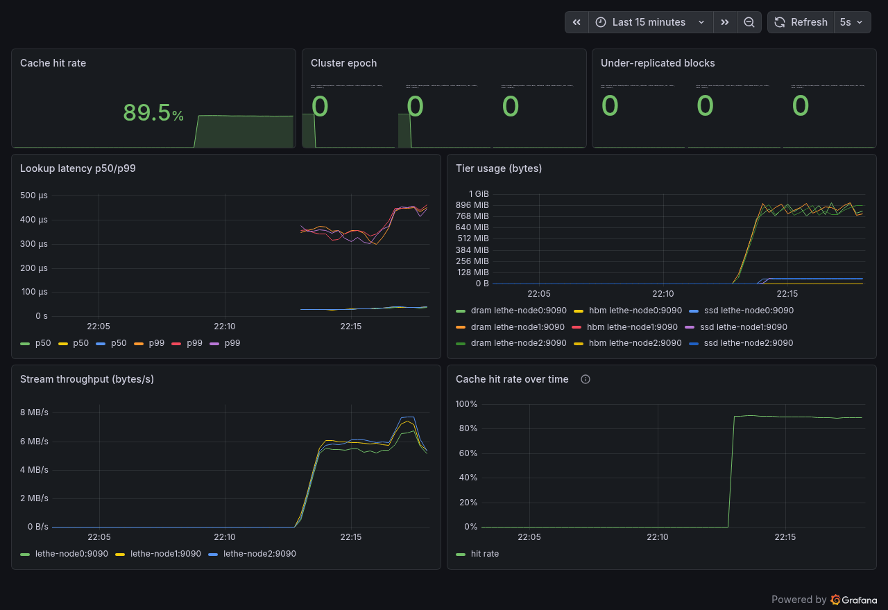
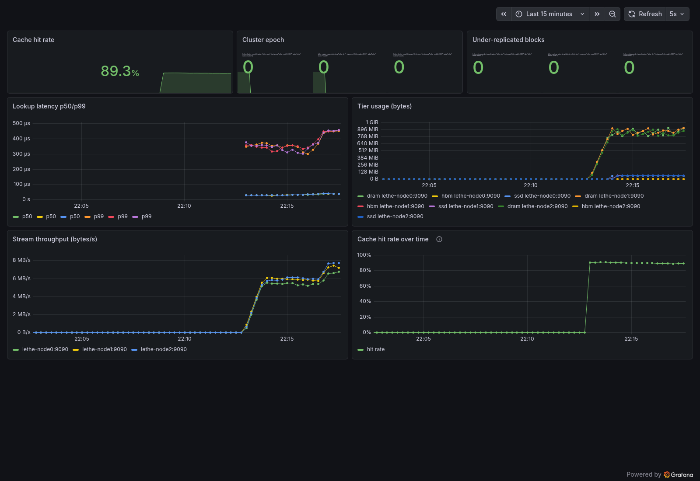
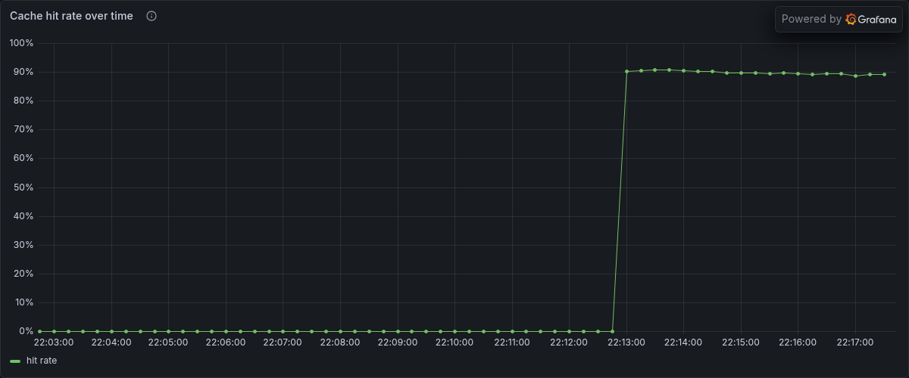
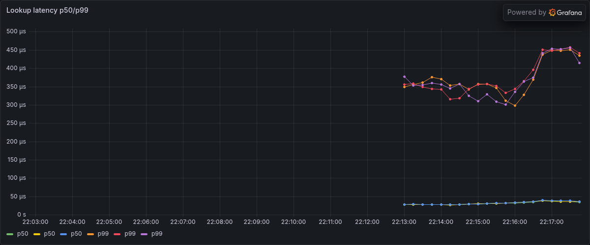
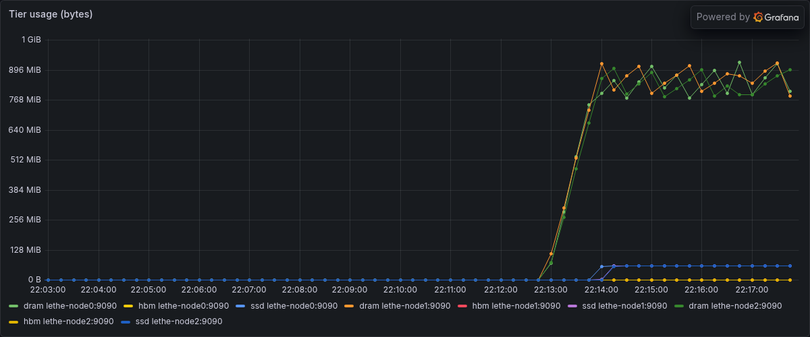
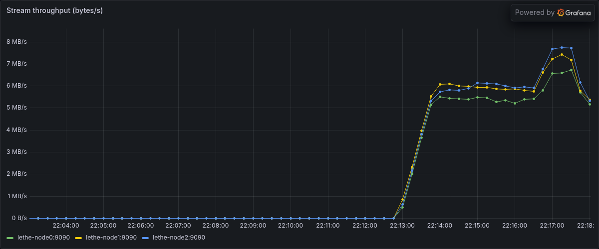
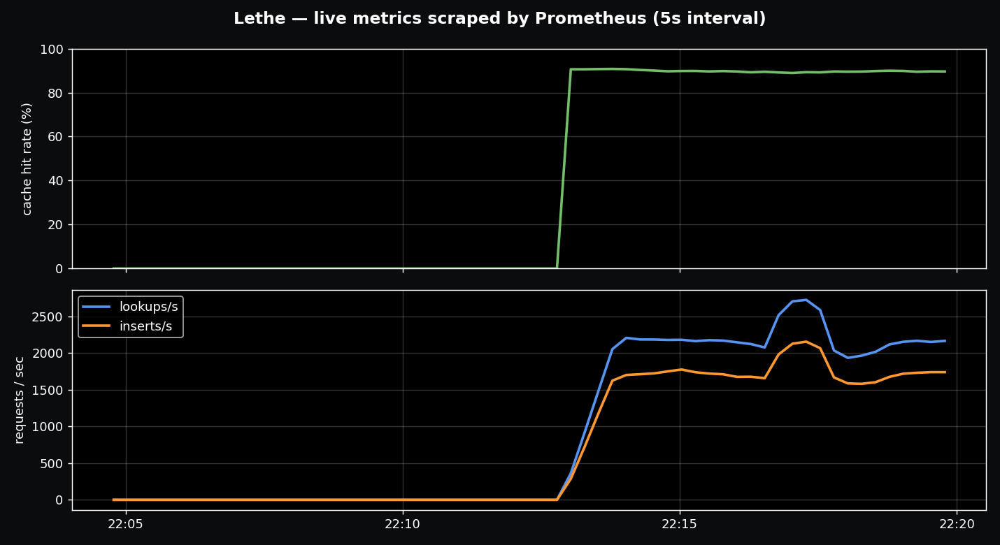

# Lethe

Lethe is a 3-node distributed, prefix-aware KV cache for disaggregated LLM
serving. It sits between vLLM prefill and decode workers and shards KV blocks
across nodes by prefix-aware consistent hashing, so a cluster can hold a
working set several times larger than any single GPU's KV memory - and keep
serving it when a node dies. Every cache hit is checked against what vLLM's own
prefix cache would have returned: the claim is token-for-token equivalence, not
"looks reasonable."

[Quickstart](#quickstart) | [Live Dashboard](#live-dashboard) | [What It Does](#what-it-does) | [Architecture](#architecture) | [Validation](#validation) | [Performance](#performance) | [Failure & Recovery](#failure--recovery) | [Build](#build-test-install)

Before asking whether a distributed cache speeds up LLM serving, ask whether it
holds more than one node can, survives a node dying mid-serve, and returns
exactly the tokens vLLM would have. Lethe is built around that standard:
prefix-aware sharding with R=2 replication, validated token-for-token against
vLLM's native prefix cache, with a chaos suite that proves the load path
survives failure - and an honest account of where the speedup does and does not
show up.



> A 3-node Lethe cluster under a synthetic insert/lookup workload: cache hit
> rate climbing to ~90%, tiered storage filling across nodes, and R=2
> replication traffic on the wire - scraped by Prometheus, rendered in Grafana.

## Contents

- [Quickstart](#quickstart)
- [Live Dashboard](#live-dashboard)
- [What It Does](#what-it-does)
- [Architecture](#architecture)
- [Validation](#validation)
- [Performance](#performance)
  - [Capacity crossover](#capacity-crossover)
  - [The latency caveat](#the-latency-caveat)
  - [RDMA on InfiniBand](#rdma-on-infiniband)
- [Failure & Recovery](#failure--recovery)
- [Build, Test, Install](#build-test-install)

## Quickstart

Build the C++ server and run the test suite:

```bash
./scripts/build.sh
ctest --test-dir build --output-on-failure
```

Bring up a 3-node cluster with Prometheus + Grafana (docker-compose):

```bash
./scripts/run_cluster.sh
# Grafana at http://localhost:3000  (dashboard: "Lethe - Distributed KV Cache")
```

Watch the cache survive a node failure - insert at R=2, hard-kill a node, keep
serving while the cluster detects the death and re-replicates:

```bash
bash scripts/failover_demo.sh           # default scenario: sigkill
```

Run the full chaos suite (six fault-injection scenarios, all invariants):

```bash
bash chaos/run_suite.sh
```

Run the capacity-crossover sweep against two vLLM configurations - single-node
native prefix cache vs. a 3-node Lethe cluster (needs a GPU + vLLM 0.19.1):

```bash
# config A = single vLLM, native prefix cache ON; config B = vLLM + Lethe
W12_CONFIG=A W12_NDIST=512 python benchmarks/crossover_sweep.py
W12_CONFIG=B W12_NDIST=512 python benchmarks/crossover_sweep.py
python benchmarks/plot_crossover.py     # consolidate medians + plot
```

## Live Dashboard

`scripts/run_cluster.sh` brings the three cache nodes up behind Prometheus (5 s
scrape) and Grafana (anonymous access, dashboard **"Lethe - Distributed KV
Cache"** at <http://localhost:3000>). The captures below are a real run: three
nodes under a mixed insert/lookup/fetch workload driven across every peer.



What the panels show as load ramps:

- **Cache hit rate over time** steps from cold to a steady ~90% once the working
  set is warm. Watch this one first - a flat-zero line here means the load/hit
  path is dead.
- **Lookup latency p50/p99** holds in the hundreds-of-microseconds band per node.
- **Tier usage** fills HBM → DRAM → SSD across all three nodes as blocks land.
- **Stream throughput** is the R=2 replication push traffic flowing between peers.

<table>
  <tr>
    <td></td>
    <td></td>
  </tr>
  <tr>
    <td></td>
    <td></td>
  </tr>
</table>

The same signals straight from Prometheus (`/api/v1/query_range`) - hit rate
stepping to ~90% as the cache warms, with sustained lookup and insert rates:



## What It Does

Lethe shards a prefix-aware KV cache across nodes, replicates it for
single-failure tolerance, tiers it across the memory hierarchy, and exposes it
to vLLM as an external prefix-cache tier. Correctness is anchored to a CPU/vLLM
reference at every layer; the distributed path is the scale path.

| Layer | Included |
|---|---|
| Routing | BLAKE3 prefix-chained block IDs `H(prev_hash ‖ tokens)`; consistent hashing, 128 virtual nodes per peer; prefix-aware ownership with no separate radix tree |
| Replication | R=2 (primary + one successor), read-repair on lookup, automatic re-replication of under-replicated blocks on node failure |
| Storage | tiered HBM → DRAM → SSD with promotion on access and demotion under pressure; cluster-wide SIEVE eviction with gossiped evict-broadcasts |
| Membership | heartbeat (200 ms), 1 s suspected, 3 s declared-dead; cluster-epoch versioned ring; no consensus protocol |
| Transports | gRPC bidi-stream (default); ibverbs/RDMA over InfiniBand behind the `KvTransport` abstraction (`-DLETHE_ENABLE_RDMA=ON`, runtime-selected by `LETHE_USE_RDMA`) |
| vLLM integration | KV-transfer connector for vLLM 0.19.1; Lethe is an external prefix-cache tier the scheduler probes and the worker loads/stores against |
| Observability | hand-rolled Prometheus exporter (hit rate, tier bytes, cluster epoch, under-replicated count, recovery time) + Grafana dashboard |
| Validation | token-identical vs. vLLM-native, cross-language hash compatibility, byte-exact KV round-trip, six chaos invariants, RDMA correctness |

Operating the cluster:

```
lethe_server <node_id> <port> --peers <id@host:port,...>          # one cache node
scripts/run_cluster.sh                                            # 3 nodes + Prom + Grafana
scripts/failover_demo.sh                                          # kill a node, watch recovery
python -m chaos.invariants --scenario {sigkill,restart,pause,partition,packet_loss,large}
python benchmarks/crossover_sweep.py                              # capacity sweep (env-configured)
python benchmarks/recovery_curve.py                               # node-kill → R=2 reconvergence
```

## Architecture

Lethe is a C++20 cache server plus a Python client/connector. The server's
subsystems form an acyclic layering - each owns its own mutex and never grabs
another's lock. Top calls into bottom: Membership → Router → Replicator →
TieredStore → BlockStore; the Evictor sits over TieredStore + Membership;
`KvTransport` stands alone; Metrics is a leaf that everyone records into.

```
proto/          gRPC service definitions (Lookup, Insert, Fetch, StreamBlocks,
                Heartbeat, EvictBroadcast) shared by server and client.

cache_server/   C++20 server. LetheCache is the facade; subsystems are Router
                (consistent-hash ring), Replicator (R=2 push + re-replication),
                TieredStore (HBM/DRAM/SSD), BlockStore (per-tier slab + mmap'd
                SSD), Evictor (cluster-wide SIEVE), Membership (heartbeat),
                Metrics (Prometheus), and KvTransport (gRPC / ibverbs).

client/         Python client + vLLM connector. The HashRing mirrors the C++
                Router bit-for-bit (same BLAKE3, same 128 vnodes, same ring-key
                format); the connector plugs Lethe into vLLM 0.19.1; an epoch
                watcher rebuilds the client ring when membership changes.

disagg/         single-engine, role-sequenced prefill→decode orchestration used
                by the token-identity correctness test.

benchmarks/     capacity-crossover sweep, recovery-curve harness, and the
                consolidation/plot script.

chaos/          fault injectors (kill, restart, pause, partition, packet loss)
                and the invariant suite asserted against a live docker cluster.

deploy/         docker-compose for the 3-node cluster, Prometheus config, and
                the Grafana dashboard.

tests/          C++ unit suites, token-identity / hash-compat / byte-identity
                correctness, and failover integration tests.
```

Block identity is `BLAKE3(prev_block_hash ‖ tokens_in_block)`, 32 bytes. The C++
and Python implementations are kept byte-compatible (same digest for the same
`(prev_hash, tokens)` and the same `f"{peer}#{vn}"` ring keys); a cross-language
driver test enforces it.

## Validation

Every cache result is checked against a deterministic reference. There is no
"looks reasonable" path: served tokens must match what vLLM's native prefix
cache produces under the same hit/miss schedule, ring routing must be
bit-identical across the C++ and Python implementations, and failure behavior
must satisfy the chaos invariants before it is treated as credible.

| Component | Reference | Result |
|---|---|---|
| Token identity (cache hit vs. miss) | vLLM native prefix cache, fixed hit/miss schedule | identical greedy token IDs |
| Disaggregated token identity | vLLM-native control (prefill→decode handoff) | identical greedy token IDs |
| KV byte round-trip | bytes in vs. bytes out across the wire | byte-exact |
| Ring routing | C++ `Router` vs. Python `HashRing` | bit-identical ring keys + block IDs |
| Connector interface | vLLM 0.19.1 `KVConnectorBase_V1` | scheduler + worker methods load cleanly |
| INV-1 no data loss | survivors hold every block after a kill | passes |
| INV-2 epoch advance | dead node detected within `dead_after` | epoch bumps (~3.3 s) |
| INV-3 reconvergence | all blocks back to R=2 after a kill | passes (size-aware budget) |
| INV-4 no stale routing | no survivor returns a RemoteHit → dead node | passes |
| INV-5 load path survives | ring hit rate stays > 0 through a kill | passes |
| INV-6 no corruption | every served block hash-matches its BlockId | passes |
| RDMA replication + recovery | InfiniBand (ConnectX-7): R=2 + failover | 0 corruption / 0 loss; TSan-clean data path |
| Determinism | same seed, two runs | bit-exact |

The chaos invariants run across six scenarios - `sigkill`, `restart`, `pause`,
`partition`, `packet_loss`, and a large-working-set case that exceeds the
re-replication batch cap on purpose. Test layout:

```
7 C++ unit suites (ctest) + Python correctness, integration, and client suites (pytest)
```

## Performance

Measured numbers, not projected throughput. The capacity results are on a
single NVIDIA L40S with `gemma-3-1b-it`, vLLM 0.19.1, median of 3 runs; the
recovery and RDMA numbers are as labeled. Raw outputs are regenerable with the
harnesses in [benchmarks/](benchmarks/) and [chaos/](chaos/).

### Capacity crossover

The honest baseline is vLLM with its **native prefix cache ON** - not disabled
- with the working set swept past a single node's KV budget. The question is
what happens to hit rate when the working set no longer fits one node.

| working set | 1 node (native cache) | Lethe (3 nodes, R=2) |
|---|---:|---:|
| 1× node KV budget | 98.8% | 98.8% |
| 2× budget | **0.0%** (collapses) | **98.8%** (sustains) |
| 4× budget | **0.0%** | **85.2%** |

Once the working set exceeds one node's KV memory, the native prefix cache
collapses to a clean 0% (every warm request thrashes), while Lethe sustains
85–99% by serving the overflow from the distributed tier - tens of thousands of
KV blocks per run (17,320 at 2×, 30,091 at 4×, confirmed via the connector's
load counters, so the hit is real and not just reported). This is the
distributed-systems result the project is about: the cache holds 2–4× what one
node can.

### The latency caveat

At 1B-model scale the capacity win does **not** convert to lower TTFT, and this
is reported rather than buried. Native recompute of a short prefill on a 1B
model is ~23 ms; a loopback KV fetch is ~53–81 ms - so a cache *hit* served over
the network is slower than a *miss* recomputed on-GPU. The latency value of a KV
cache only appears when per-token recompute cost exceeds fetch cost, which needs
a larger model and/or a kernel-bypass transport. The measurement is on 1B, and
is reported as a **capacity** result, not a latency one.

### RDMA on InfiniBand

The `KvTransport` abstraction has two implementations: gRPC (default) and an
ibverbs/RDMA data path. The RDMA path is implemented and functionally validated
on real InfiniBand (Mellanox ConnectX-7): `rdma_cm` connection setup, one RC
queue pair per peer, two-sided SEND/RECV for the replication push path, and a
per-connection completion-polling thread. Under it, R=2 replication and
node-failure recovery run with **0 corruption / 0 loss**, and ThreadSanitizer
finds no races in the completion-polling/send/recv path.

The fabric's RDMA ceiling, measured independently with `ib_write_bw`, is
**11.4 GiB/s** between two nodes. A like-for-like RDMA-vs-gRPC throughput
benchmark for the transport itself was not completed, so no transport speedup
number is claimed here.

## Failure & Recovery

When a node dies, the heartbeat detector declares it dead after `dead_after`
(3 s default), the cluster epoch bumps, the router rebuilds, and the Replicator
re-replicates every under-replicated block onto the survivors until the cluster
is back at R=2. The recovery curve below is node-kill → full R=2
reconvergence, three loopback processes, median of 3:

| working set | recovery |
|---:|---:|
| 200 blocks | 3.7 s |
| 500 blocks | 4.4 s |
| 1,000 blocks | 7.6 s |
| 2,000 blocks | 12.0 s |

Recovery is ~3 s of detection plus a re-replication drain that scales with the
working set. On the docker bridge the fixed per-RPC latency dominates instead,
giving a flatter 13–22 s; loopback strips that overhead and exposes the
underlying per-block cost. `scripts/failover_demo.sh` makes this visual on
Grafana: the cluster epoch steps up, the under-replicated count spikes then
drains to zero, and the cache hit rate stays up because the survivors still hold
the R=2 replicas.

## Build, Test, Install

Requires CMake ≥ 3.20 and a C++20 compiler; the default build needs only gRPC +
protobuf (BLAKE3 is vendored). `libibverbs`/`librdmacm` are pulled in only with
`-DLETHE_ENABLE_RDMA=ON`; the Prometheus exporter is hand-rolled, so
`prometheus-cpp` is not a dependency.

```bash
./scripts/build.sh
ctest --test-dir build --output-on-failure
```

Python client + vLLM connector and its test suite:

```bash
cd client && pip install -e .
pytest tests/
```

Running the cluster needs Docker (for `run_cluster.sh` / the chaos suite); the
capacity sweep needs a CUDA GPU and vLLM 0.19.1; the RDMA path needs an
InfiniBand-capable host built with `-DLETHE_ENABLE_RDMA=ON`.

## Out of scope

CXL, multi-tenancy with isolation, dynamic shard rebalancing under load, full
Raft for membership (static seed list + heartbeats is enough - production
systems delegate this to etcd/ZooKeeper), Kubernetes deployment, autoscaling,
and custom paged-attention kernels.

## References

- Mooncake: A KVCache-centric Disaggregated Architecture for LLM Serving (ACM TOS 2025)
- DistServe: Disaggregating Prefill and Decoding for Goodput-optimized LLM Serving (OSDI '24)
- Llumnix: Dynamic Scheduling for Large Language Model Serving (OSDI '24)
- LMCache: An Efficient KV Cache Layer for Enterprise-scale LLM Inference
- SIEVE is Simpler than LRU (NSDI '24)
- vLLM: Efficient Memory Management for LLM Serving with PagedAttention (SOSP '23)

